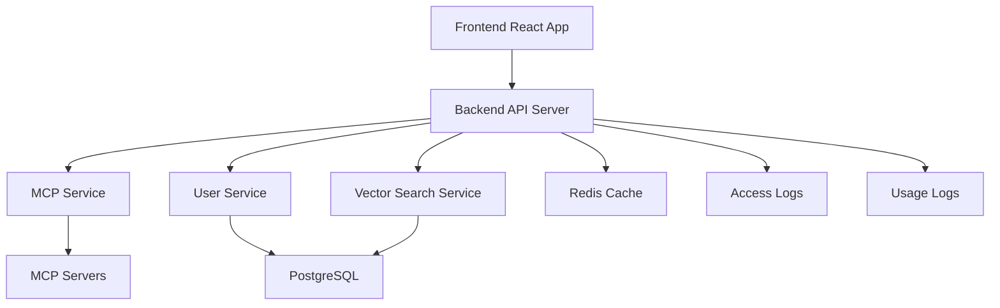

# MCPHub 项目组织结构

## 📋 项目概述

MCPHub是一个MCP(Model Context Protocol)服务器管理平台，采用前后端分离架构，使用TypeScript开发。

## 🏗️ 项目架构

```
mcphub-origin/
├── 📁 Backend (Node.js + TypeScript)
├── 📁 Frontend (React + Vite + TypeScript)
├── 📁 Docker 配置和脚本
├── 📁 文档和配置
└── 📁 测试和构建工具
```

## 📂 目录结构详解

### 🔧 核心后端代码 (`src/`)

```
src/
├── 🎮 controllers/          # 控制器层 - 处理HTTP请求
│   ├── authController.ts    # 用户认证控制器
│   ├── serverController.ts  # MCP服务器管理控制器
│   ├── userController.ts    # 用户管理控制器
│   ├── toolController.ts    # 工具调用控制器
│   ├── groupController.ts   # 服务器分组控制器
│   ├── marketController.ts  # 市场/商店控制器
│   ├── configController.ts  # 配置管理控制器
│   ├── dxtController.ts     # DXT相关控制器
│   ├── logController.ts     # 日志控制器
│   ├── accessLogController.ts # 访问日志控制器
│   └── mcpUsageController.ts  # MCP使用统计控制器
│
├── 🔨 services/             # 服务层 - 业务逻辑
│   ├── mcpService.ts        # MCP服务核心逻辑 (42KB - 核心服务)
│   ├── vectorSearchService.ts # 向量搜索服务 (22KB)
│   ├── accessLogService.ts  # 访问日志服务
│   ├── userService.ts       # 用户管理服务
│   ├── groupService.ts      # 分组管理服务
│   ├── marketService.ts     # 市场服务
│   ├── sseService.ts        # 服务端推送服务
│   ├── mcpUsageLogger.ts    # MCP使用日志服务
│   ├── logService.ts        # 系统日志服务
│   ├── dataService.ts       # 数据处理服务
│   ├── registry.ts          # 服务注册器
│   └── userContextService.ts # 用户上下文服务
│
├── 🗄️ db/                   # 数据库层
│   ├── connection.ts        # 数据库连接管理
│   ├── entities/           # 数据实体定义
│   ├── repositories/       # 数据仓库模式
│   ├── subscribers/        # 数据库事件订阅
│   └── types/             # 数据库类型定义
│
├── 🌐 routes/              # 路由定义
├── 🛡️ middlewares/         # 中间件
├── 🔧 config/              # 配置管理
├── 🏷️ types/               # TypeScript类型定义
├── 🛠️ utils/               # 工具函数
├── 👥 models/              # 数据模型
├── 📡 clients/             # 外部客户端
├── server.ts              # 服务器主类
└── index.ts               # 应用入口点
```

### 🎨 前端代码 (`frontend/`)

```
frontend/
├── src/
│   ├── 🧩 components/      # React组件
│   ├── 📄 pages/          # 页面组件
│   ├── 🎯 services/       # 前端服务层
│   ├── 🎨 layouts/        # 布局组件
│   ├── 🪝 hooks/          # 自定义Hooks
│   ├── 🗂️ contexts/       # React Context
│   ├── 🔧 utils/          # 工具函数
│   ├── 🏷️ types/          # TypeScript类型
│   ├── 🌍 locales/        # 国际化文件
│   ├── 📊 constants/      # 常量定义
│   ├── App.tsx           # 主应用组件
│   ├── main.tsx          # 应用入口
│   ├── i18n.ts           # 国际化配置
│   └── index.css         # 全局样式
│
├── public/               # 静态资源
├── dist/                # 构建输出
├── vite.config.ts       # Vite配置
├── tsconfig.json        # TypeScript配置
├── tailwind.config.js   # Tailwind CSS配置
└── postcss.config.js    # PostCSS配置
```

### 🐳 Docker和运维 (`根目录`)

```
根目录/
├── 🐳 Docker配置
│   ├── Dockerfile           # 容器构建文件
│   ├── docker-compose.yml   # 服务编排配置
│   ├── docker.env.example   # 环境变量模板
│   ├── .dockerignore       # Docker忽略文件
│   └── entrypoint.sh       # 容器入口脚本
│
├── 📜 运维脚本
│   ├── docker-start.sh     # Docker启动脚本
│   ├── docker-stop.sh      # Docker停止脚本
│   ├── docker-health-check.sh # 健康检查脚本
│   ├── docker-backup.sh    # 数据备份脚本
│   ├── docker-restore.sh   # 数据恢复脚本
│   ├── start.sh           # 本地启动脚本
│   ├── stop.sh            # 本地停止脚本
│   └── install.sh         # 安装脚本
│
└── 🔧 验证和测试脚本
    ├── validate-config.sh      # 配置验证脚本
    ├── test-windows-environment.sh # Windows环境测试
    ├── simple_test.cjs         # 简单测试脚本
    └── compile_and_test.bat    # 编译测试脚本
```

### 🗂️ 配置和脚本 (`scripts/`)

```
scripts/
├── init-postgres.sql       # PostgreSQL初始化脚本
├── check-pgvector.sh      # pgvector扩展检查
└── verify-dist.js         # 构建验证脚本
```

### 📚 文档和示例

```
📚 文档/
├── docs/                  # 项目文档
│   ├── api-reference/     # API参考文档
│   ├── configuration/     # 配置说明
│   ├── development/       # 开发指南
│   ├── essentials/        # 基础文档
│   ├── features/          # 功能介绍
│   ├── images/           # 文档图片
│   ├── zh/               # 中文文档
│   └── snippets/         # 代码片段
│
├── examples/             # 使用示例
├── articals/             # 文章和教程
│
├── README.md             # 项目说明（英文）
├── README.zh.md          # 项目说明（中文）
├── ACCESS_TOKEN_GUIDE.md # 访问令牌指南
├── USER_MANAGEMENT_GUIDE.md # 用户管理指南
└── DOCKER_OPTIMIZATION_REPORT.md # Docker优化报告
```

### 🔧 配置文件

```
配置文件/
├── 📦 包管理
│   ├── package.json         # 项目依赖和脚本
│   ├── pnpm-lock.yaml      # 包锁定文件
│   └── pnpm-workspace.yaml # 工作空间配置
│
├── 🏷️ TypeScript
│   ├── tsconfig.json       # TS主配置
│   └── tsconfig.test.json  # 测试TS配置
│
├── 🧪 测试和质量
│   ├── jest.config.cjs     # Jest测试配置
│   ├── .eslintrc.json      # ESLint配置
│   ├── .prettierrc         # Prettier格式化配置
│   └── .coveragerc         # 代码覆盖率配置
│
├── 🌐 运行时配置
│   ├── mcp_settings.json   # MCP服务器设置
│   ├── servers.json        # 服务器列表 (2.4MB)
│   ├── env.example         # 环境变量模板
│   └── nginx.conf.example  # Nginx配置示例
│
└── 🗂️ 其他
    ├── .gitignore          # Git忽略文件
    ├── .dockerignore       # Docker忽略文件
    └── LICENSE             # 开源许可证
```

### 📊 数据和日志

```
数据目录/
├── 📁 access_logs/        # 访问日志目录
├── 📁 mcp_usage_logs/     # MCP使用日志目录
├── 📁 dist/               # 构建输出目录
├── 📁 node_modules/       # 依赖包目录
└── 📁 tests/              # 测试文件目录
```

## 🏛️ 架构模式

### 🔙 后端架构
- **分层架构**: Controller → Service → Repository → Database
- **依赖注入**: 使用服务注册器管理依赖
- **中间件模式**: 认证、日志、错误处理等
- **事件驱动**: 数据库订阅者和事件处理

### 🎨 前端架构
- **组件化**: React函数组件 + Hooks
- **状态管理**: Context API + useState/useReducer
- **路由管理**: React Router
- **构建工具**: Vite + TypeScript

### 🗄️ 数据层
- **ORM**: TypeORM
- **数据库**: PostgreSQL (带pgvector扩展)
- **缓存**: Redis
- **文件存储**: 本地文件系统

## 🔗 核心模块关系



## 📈 代码统计

| 组件 | 文件数 | 主要文件大小 |
|------|--------|-------------|
| 后端控制器 | 11个 | 平均 6-20KB |
| 后端服务 | 14个 | mcpService.ts (42KB) |
| 数据库层 | 4个目录 | connection.ts (14KB) |
| 前端组件 | 10个目录 | 按功能模块组织 |
| 配置文件 | 15个 | servers.json (2.4MB) |

## 🎯 核心特性模块

1. **🔐 认证系统** - JWT + 用户管理
2. **🔌 MCP服务管理** - 服务器连接和管理
3. **🔍 向量搜索** - 智能工具发现
4. **📊 使用统计** - 访问日志和使用分析
5. **👥 分组管理** - 服务器分组和权限
6. **🏪 市场功能** - 服务器商店和发现
7. **📡 实时通信** - SSE服务端推送
8. **🌍 国际化** - 多语言支持

## 🔧 开发和部署

- **开发环境**: TypeScript + Node.js + React + Vite
- **生产部署**: Docker + Docker Compose
- **数据持久化**: PostgreSQL + Redis数据卷
- **监控日志**: 结构化日志 + 访问统计
- **测试框架**: Jest + 集成测试

这个项目组织体现了现代全栈应用的最佳实践，具有清晰的分层架构、完整的开发工具链和生产就绪的部署配置。