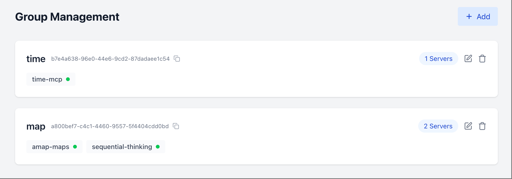

[](https://mseep.ai/app/samanhappy-mcphub)

# MCPHub: Your Ultimate MCP Server Hub

English | [中文版](README.zh.md)

MCPHub is a unified management platform that aggregates multiple MCP (Model Context Protocol) servers into separate Streamable HTTP (SSE) endpoints for different scenarios by group. It streamlines your AI tool integrations through an intuitive interface and robust protocol handling.


## 🚀 Features

- **Out-of-the-Box MCP Server Support**: Seamlessly integrate popular servers like `amap-maps`, `playwright`, `fetch`, `slack`, and more.
- **Centralized Dashboard**: Monitor real-time status and performance metrics from one sleek web UI.
- **Flexible Protocol Handling**: Full compatibility with both stdio and SSE MCP protocols.
- **Hot-Swappable Configuration**: Add, remove, or update MCP servers on the fly — no downtime required.
- **Group-Based Access Control**: Organize servers into customizable groups for streamlined permissions management.
- **Secure Authentication**: Built-in user management with role-based access powered by JWT and bcrypt.
- **Docker-Ready**: Deploy instantly with our containerized setup.

## 🔧 Quick Start

### Optional Configuration

Create a `mcp_settings.json` file to customize your server settings:

```json
{
  "mcpServers": {
    "amap": {
      "command": "npx",
      "args": ["-y", "@amap/amap-maps-mcp-server"],
      "env": {
        "AMAP_MAPS_API_KEY": "your-api-key"
      }
    },
    "playwright": {
      "command": "npx",
      "args": ["@playwright/mcp@latest", "--headless"]
    },
    "fetch": {
      "command": "uvx",
      "args": ["mcp-server-fetch"]
    },
    "slack": {
      "command": "npx",
      "args": ["-y", "@modelcontextprotocol/server-slack"],
      "env": {
        "SLACK_BOT_TOKEN": "your-bot-token",
        "SLACK_TEAM_ID": "your-team-id"
      }
    }
  },
  "users": [
    {
      "username": "admin",
      "password": "$2b$10$Vt7krIvjNgyN67LXqly0uOcTpN0LI55cYRbcKC71pUDAP0nJ7RPa.",
      "isAdmin": true
    }
  ]
}
```

> **Note**: Default credentials are `admin` / `admin123`. Passwords are securely hashed with bcrypt. Generate a new hash with:
>
> ```bash
> npx bcryptjs your-password
> ```

### Docker Deployment

**Recommended**: Mount your custom config:
```bash
docker run -p 3000:3000 -v $(pwd)/mcp_settings.json:/app/mcp_settings.json samanhappy/mcphub
```

or run with default settings:
```bash
docker run -p 3000:3000 samanhappy/mcphub
```

### Access the Dashboard

Open `http://localhost:3000` and log in with your credentials.
> **Note**: Default credentials are `admin` / `admin123`.

**Dashboard Overview**:
- Live status of all MCP servers
- Enable/disable or reconfigure servers
- Group management for organizing servers
- User administration for access control

### Streamable HTTP Endpoint
> As of now, support for streaming HTTP endpoints varies across different AI clients. If you encounter issues, you can use the SSE endpoint or wait for future updates.

Connect AI clients (e.g., Claude Desktop, Cursor, DeepChat, etc.) via:
```
http://localhost:3000/mcp
```
This endpoint provides a unified streamable HTTP interface for all your MCP servers. It allows you to:
- Send requests to any configured MCP server
- Receive responses in real-time
- Easily integrate with various AI clients and tools
- Use the same endpoint for all servers, simplifying your integration process

**Group-Specific Endpoints (Recommended)**:



For targeted access to specific server groups, use the group-based HTTP endpoint:
```
http://localhost:3000/mcp/{group}
```

Where `{group}` is the ID or name of the group you created in the dashboard. This allows you to:
- Connect to a specific subset of MCP servers organized by use case
- Isolate different AI tools to access only relevant servers
- Implement more granular access control for different environments or teams

**Server-Specific Endpoints**:
For direct access to individual servers, use the server-specific HTTP endpoint:
```
http://localhost:3000/mcp/{server}
```
Where `{server}` is the name of the server you want to connect to. This allows you to access a specific MCP server directly.

> **Note**: If the server name and group name are the same, the group name will take precedence.

### SSE Endpoint (Deprecated in Future)

Connect AI clients (e.g., Claude Desktop, Cursor, DeepChat, etc.) via:
```
http://localhost:3000/sse
```

For targeted access to specific server groups, use the group-based SSE endpoint:
```
http://localhost:3000/sse/{group}
```

For direct access to individual servers, use the server-specific SSE endpoint:
```
http://localhost:3000/sse/{server}
```

## 🧑‍💻 Local Development

```bash
git clone https://github.com/samanhappy/mcphub.git
cd mcphub
pnpm install
pnpm dev
```

This starts both frontend and backend in development mode with hot-reloading.

> For windows users, you may need to start the backend server and frontend separately: `pnpm backend:dev`, `pnpm frontend:dev`.

## 🛠️ Common Issues

### Using Nginx as a Reverse Proxy
If you are using Nginx to reverse proxy MCPHub, please make sure to add the following configuration in your Nginx setup:

```nginx
proxy_buffering off
```

## 🔍 Tech Stack

- **Backend**: Node.js, Express, TypeScript
- **Frontend**: React, Vite, Tailwind CSS
- **Auth**: JWT & bcrypt
- **Protocol**: Model Context Protocol SDK

## 👥 Contributing

Contributions are welcome!

- New features & optimizations
- Documentation improvements
- Bug reports & fixes
- Translations & suggestions

## ❤️ Sponsor

If you like this project, maybe you can consider:

[](https://ko-fi.com/samanhappy)

## 📄 License

Licensed under the [Apache 2.0 License](LICENSE).
