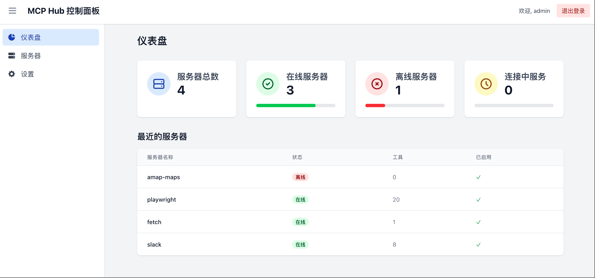

# MCPHub：一站式 MCP 服务器聚合平台

[English Version](README.md) | 中文版

MCPHub 是一个统一的 MCP（Model Context Protocol，模型上下文协议）服务器聚合平台，可以根据场景将多个服务器聚合到不同的 SSE 端点。它通过直观的界面和强大的协议处理能力，简化了您的 AI 工具集成流程。



## 🚀 功能亮点

- **开箱即用的 MCP 服务器支持**：无缝集成 `amap-maps`、`playwright`、`fetch`、`slack` 等常见服务器。
- **集中式管理控制台**：在一个简洁的 Web UI 中实时监控所有服务器的状态和性能指标。
- **灵活的协议兼容**：完全支持 stdio 和 SSE 两种 MCP 协议。
- **热插拔式配置**：在运行时动态添加、移除或更新服务器配置，无需停机。
- **基于分组的访问控制**：自定义分组并管理服务器访问权限。
- **安全认证机制**：内置用户管理，基于 JWT 和 bcrypt，实现角色权限控制。
- **Docker 就绪**：提供容器化镜像，快速部署。

## 🔧 快速开始

### 可选配置

通过创建 `mcp_settings.json` 自定义服务器设置：

```json
{
  "mcpServers": {
    "amap-maps": {
      "command": "npx",
      "args": ["-y", "@amap/amap-maps-mcp-server"],
      "env": {
        "AMAP_MAPS_API_KEY": "your-api-key"
      }
    },
    "playwright": {
      "command": "npx",
      "args": ["@playwright/mcp@latest", "--headless"]
    },
    "fetch": {
      "command": "uvx",
      "args": ["mcp-server-fetch"]
    },
    "slack": {
      "command": "npx",
      "args": ["-y", "@modelcontextprotocol/server-slack"],
      "env": {
        "SLACK_BOT_TOKEN": "your-bot-token",
        "SLACK_TEAM_ID": "your-team-id"
      }
    }
  },
  "users": [
    {
      "username": "admin",
      "password": "$2b$10$Vt7krIvjNgyN67LXqly0uOcTpN0LI55cYRbcKC71pUDAP0nJ7RPa.",
      "isAdmin": true
    }
  ]
}
```

> **提示**：默认用户名/密码为 `admin` / `admin123`。密码已通过 bcrypt 安全哈希。生成新密码哈希：
>
> ```bash
> npx bcryptjs your-password
> ```

### Docker 部署

**推荐**：挂载自定义配置：
```bash
docker run -p 3000:3000 -v $(pwd)/mcp_settings.json:/app/mcp_settings.json samanhappy/mcphub
```

或使用默认配置运行：
```bash
docker run -p 3000:3000 samanhappy/mcphub
```

### 访问控制台

打开 `http://localhost:3000`，使用您的账号登录。
> **提示**：默认用户名/密码为 `admin` / `admin123`。

**控制台功能**：
- 实时监控所有 MCP 服务器状态
- 启用/禁用或重新配置服务器
- 分组管理，组织服务器访问
- 用户管理，设定权限

### SSE 端点集成

通过以下地址连接 AI 客户端（如 Claude Desktop、Cursor、Cherry Studio 等）：
```
http://localhost:3000/sse
```

## 🧑‍💻 本地开发

```bash
git clone https://github.com/samanhappy/mcphub.git
cd mcphub
pnpm install
pnpm dev
```

此命令将在开发模式下启动前后端，并启用热重载。

## 🔍 技术栈

- **后端**：Node.js、Express、TypeScript
- **前端**：React、Vite、Tailwind CSS
- **认证**：JWT & bcrypt
- **协议**：Model Context Protocol SDK

## 👥 贡献指南

期待您的贡献！

- 新功能与优化
- 文档完善
- Bug 报告与修复
- 翻译与建议

## 📄 许可证

本项目采用 [Apache 2.0 许可证](LICENSE)。
