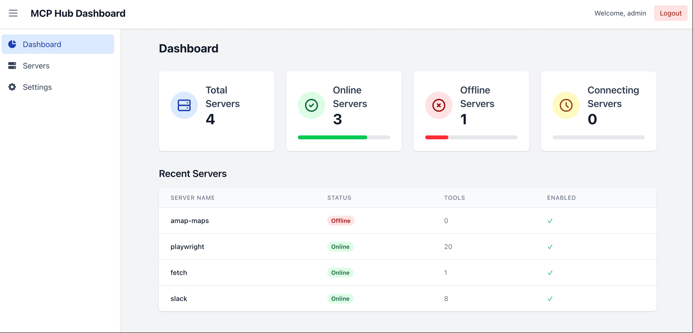

# MCPHub：一键部署你的专属 MCP 服务

[English Version](README.md) | 中文版

MCPHub 是一款统一的中心服务，可以将多个 MCP（Model Context Protocol）服务整合为一个 SSE 端点。它通过提供一个集中的管理界面来简化服务管理，满足您对 MCP 服务的所有需求。



## 功能

- **内置精选 MCP 服务**：默认安装 `amap-maps`、`playwright`、`slack` 等热门服务，开箱即用。
- **集中管理**：通过单一中心轻松管理多个 MCP 服务。
- **协议兼容**：同时支持 stdio 与 SSE MCP 协议，确保无缝对接。
- **直观仪表盘**：通过 Web 界面实时监控服务状态，并动态管理服务。
- **灵活配置**：无需重启中心服务即可添加、移除或重新配置 MCP 服务。

## 快速开始

### 使用 Docker 部署

运行以下命令即可快速启动 MCPHub：

```bash
docker run -p 3000:3000 samanhappy/mcphub
```

### 仪表盘访问

在浏览器中打开以下地址：  
`http://localhost:3000`

仪表盘提供以下功能：
- **实时监控**：随时查看所有 MCP 服务的运行状态。
- **服务状态指示**：快速识别各服务是否在线。
- **动态管理**：无需重启即可动态添加或移除 MCP 服务。

### SSE 端点

您可以将主机应用（如 Claude Desktop、Cursor、Cherry Studio 等）无缝连接至 MCPHub 的 SSE 端点：  
`http://localhost:3000/sse`

## 本地开发

### 克隆代码库

请使用以下命令克隆 MCPHub 仓库：

```bash
git clone https://github.com/samanhappy/mcphub.git
```

### 可选配置

通过编辑 `mcp_settings.json` 文件来自定义 MCP 服务设置。例如：

```json
{
  "mcpServers": {
    "time-mcp": {
      "command": "npx",
      "args": ["-y", "time-mcp"]
    },
    "sequential-thinking": {
      "command": "npx",
      "args": ["-y", "@modelcontextprotocol/server-sequential-thinking"]
    }
  }
}
```

### 启动开发服务

安装依赖并启动 MCPHub：

```bash
cd mcphub && pnpm install && pnpm dev
```

## 许可证

本项目采用 [MIT 许可证](LICENSE)。
