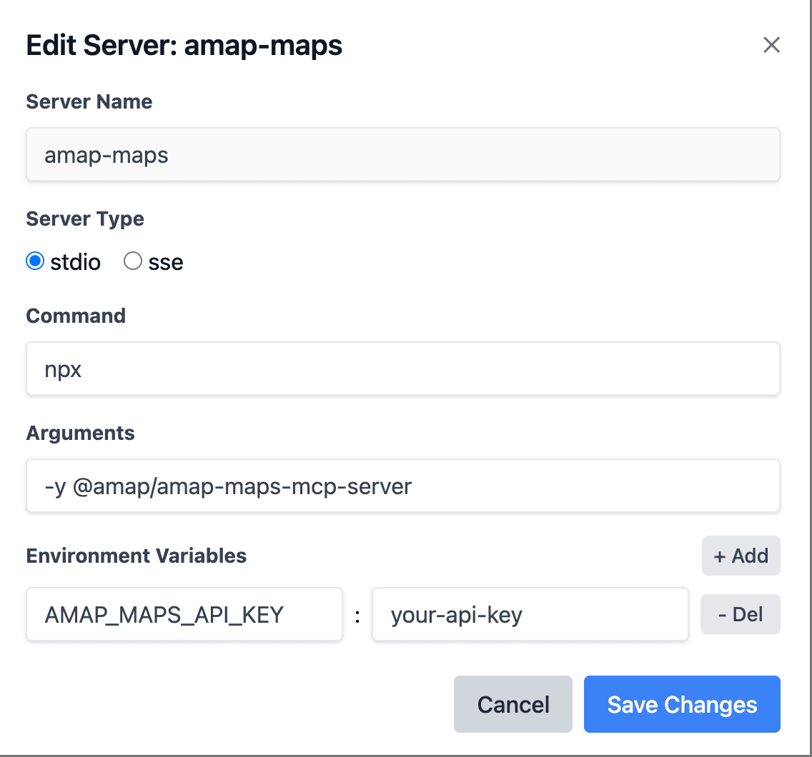
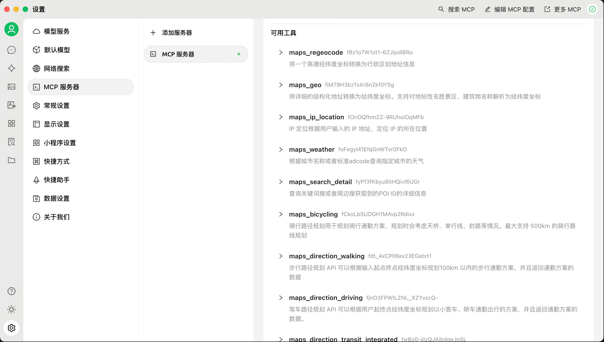
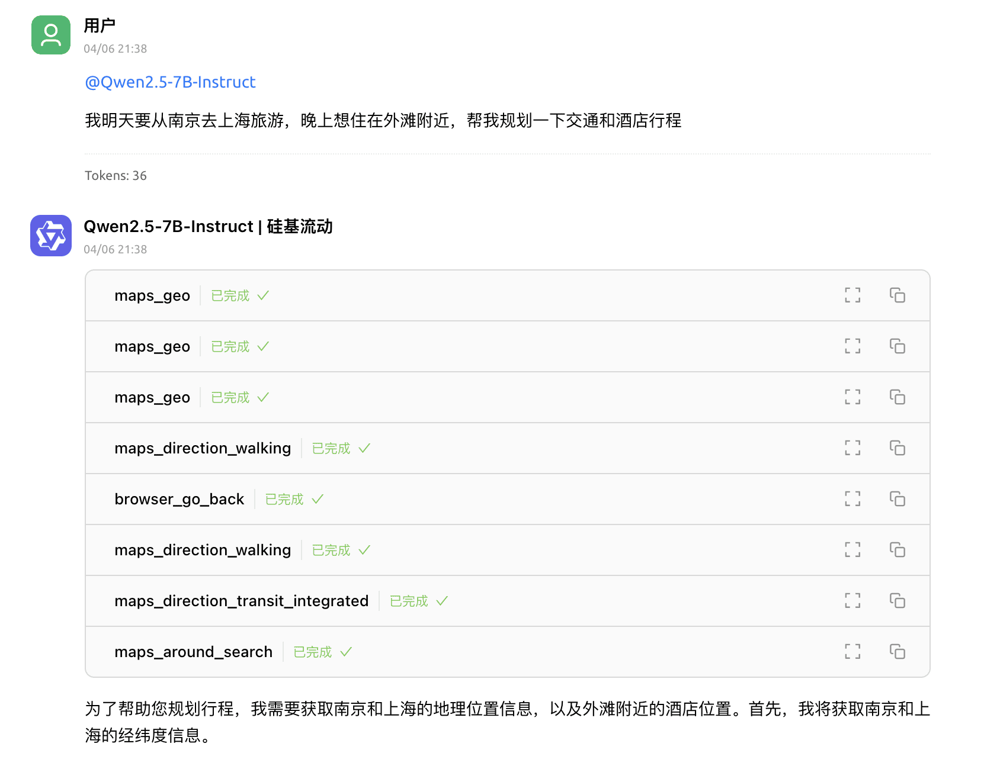

# 如何一键部署你的专属 MCP 服务

MCP 正在成为行业事实标准，如何快速搭建和管理多个 MCP 服务成为个人开发者的痛点。

## 什么是 MCP？

模型上下文协议（MCP）是由 Anthropic 推出的开放标准，旨在为大型语言模型（LLMs）提供一个标准化接口，使其能直接连接外部数据源和工具。简单来说，MCP 就像是 AI 应用的 USB-C 接口，统一解决了数据孤岛和定制化集成的问题。通过 MCP，AI 模型不仅可以实时获取最新信息，还能调用外部工具完成各类任务，实现跨平台、跨数据源的无缝交互。

## 当下的 MCP 生态

尽管 MCP 的标准化接口为 AI 应用的开发提供了便利，但在实际应用中，如何快速搭建和管理多个 MCP 服务仍然是一个挑战。MCPHub 正是为了解决这一问题而诞生的，它提供了一个集中管理和动态配置的解决方案，让个人开发者能够轻松应对多样化的需求。

## 一键部署，轻松满足个人需求

对于个人开发者而言，繁琐的部署流程常常成为创新的绊脚石。MCPHub 的亮点在于其“一键部署”功能：
  
- **极简部署**：只需一条 Docker 命令，即可快速启动 MCPHub 服务，几分钟内即可搭建起专属的 MCP 服务平台，满足你对个人项目或实验室环境的所有需求。

- **动态扩展**：在使用过程中，你可以随时通过 Web 仪表盘添加、移除或调整 MCP 服务器配置，而不必重启整个系统。这种灵活性不仅适用于个人开发测试，也为将来的功能扩展提供了无限可能。

- **标准化接口**：基于 MCP 标准，你的服务可以无缝对接各种 AI 工具，无论是 Claude Desktop、Cursor 还是其他定制化应用，都能通过统一接口调用外部数据或执行工具操作，实现真正的多源协同。

## 快速上手指南

下面，我们将通过一个示例，展示如何使用 MCPHub 快速搭建一个基于高德地图 MCP 服务的行程规划助手。

### 使用 Docker 部署
执行以下命令，即可在本地快速启动 MCPHub 服务：
```bash
docker run -p 3000:3000 samanhappy/mcphub
```
### 访问仪表盘
目前 MCPHub 已经内置了多个常用 MCP 服务，如高德地图、github、slack、fetch、tavily、playwright，开箱即可使用。在浏览器中打开 `http://localhost:3000`，直观的仪表盘将实时显示各个 MCP 服务器的状态，让你轻松管理和监控服务运行情况。


可以看到这些 MCP 服务都已经正常连接。

### 配置高德地图

因为高德地图的 MCP 服务需要 API Key，所以我们需要在仪表盘中配置高德地图的 API Key。点击 amap-maps 右边的 Edit 按钮即可在弹出的窗口的环境变量中配置高德地图的 API Key。



点击保存后，MCP Hub 将会自动重启高德地图的 MCP 服务。

### 配置 MCP Hub SSE

MCP Hub 提供了单一聚合的 MCP Server SSE 端点：`http://localhost:3000/sse`，可以在任意支持 MCP 的客户端中配置使用，这里我们选择开源的 Cherry Studio 用来演示。



配置成功后，可以看到可用工具中已经列出了所有高德 MCP 服务支持的工具。

### 使用高德地图 MCP 服务

下面，我们就可以在 Cherry Studio 中使用高德地图的 MCP 服务了。我们可以选择硅基流动的 Qwen2.5-7B-Instruct 模型，并且记得把下面 MCP Server 的开关打开，接着输入“我明天要从南京去上海旅游，晚上想住在外滩附近，帮我规划一下交通和酒店行程”，然后点击发送按钮。
  


可以看到，Cherry Studio 在回答过程中成功调用了高德地图 MCP 服务的多个 工具，包括高德地图的路线规划、酒店查询等功能，最终返回了一个完整的行程规划方案。

## 结语

MCPHub 的一键部署和动态配置功能，让个人开发者能够轻松搭建和管理多个 MCP 服务，极大地提升了开发效率和灵活性。无论是个人项目还是实验室环境，MCPHub 都能为你提供一个高效、便捷的解决方案。未来，我们将继续扩展更多的 MCP 服务和功能，敬请期待！